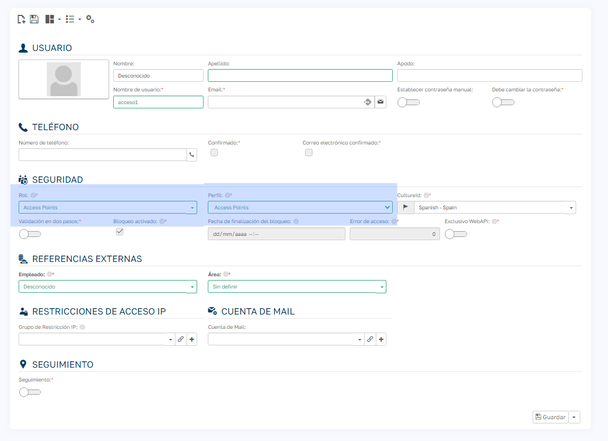
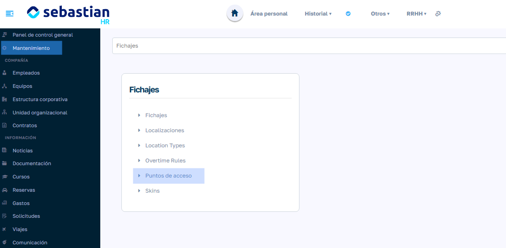
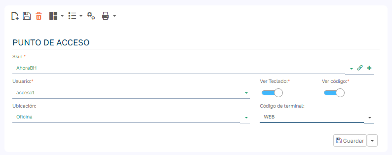
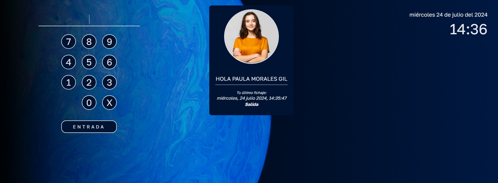

# Configurar un Punto de Acceso

Un punto de acceso convierte un dispositivo, ya sea una tablet o un PC con pantalla, en un terminal donde los empleados y las empleadas pueden fichar al entrar o salir de las instalaciones de la compañía.

## Pasos para configurarlo

1. Crea un usuario con el rol **Access Points** y el perfil **Access Points** desde `Mantenimiento > Parámetros > Gestión de usuarios`. Cada punto de acceso necesita su propio usuario: un mismo usuario no puede asignarse a dos puntos de acceso.

    

2. Ve a `Mantenimiento > Registros de tiempo > Puntos de acceso`.

    

3. Crea un nuevo punto de acceso y rellena:

    | Campo | Descripción |
    | --- | --- |
    | Skin | Aspecto de la pantalla (imagen de fondo y colores). Puedes elegir una de las que vienen de serie o crear una nueva en `Mantenimiento > Registros de tiempo > Skins`. |
    | Usuario | El usuario creado en el paso 1. |
    | Ubicación | Localización que se guardará en cada fichaje hecho desde este punto de acceso. Es opcional. |
    | Código de terminal | Opcional. Identifica el terminal en los fichajes y debe existir antes en `Mantenimiento > Registros de tiempo > Terminales`. |
    | Ver Teclado | Muestra el teclado numérico en pantalla. Desactívalo si los empleados fichan con un lector de tarjetas. |
    | Ver código | Muestra u oculta el código que teclea el empleado. |
    | Ver ubicación | Muestra la ubicación en la pantalla del punto de acceso. |

    

4. En la ficha de cada empleado, rellena el campo **Código de acceso** con el código que usará para fichar. Tiene que ser único: si otro empleado ya lo tiene, la aplicación avisa al guardar. Se recomiendan códigos numéricos, porque el teclado en pantalla solo tiene dígitos.

5. Inicia sesión en el dispositivo con el usuario del punto de acceso. A partir de ese momento el dispositivo muestra directamente la pantalla de fichaje.

    

## Cómo se ficha

1. El empleado teclea su código de acceso (o acerca su tarjeta, si hay un [lector RFID](dispositivos-rfid.es.md)) y pulsa **Validar** o Intro.
2. La pantalla muestra su nombre y su último fichaje.
3. El empleado confirma con el botón o con otra pulsación de Intro.

El tipo de fichaje (entrada o salida) lo decide la aplicación, alternando según el último fichaje del empleado. Los empleados bloqueados no pueden fichar.
