# Casos de Uso de Fichajes de Empleado

## Consideraciones previas

En este documento no vamos a tener en cuenta los casos especiales de configuración de descansos que pueden modificar el comportamiento y la generación de fichajes, estos casos los podemos consultar en los siguientes documentos:

[Descuentos automáticos de descansos de la jornada](../../turnos-y-planificacion/descuento-automatico-de-descansos.es.md)

[Aplicar descansos mínimos](../../turnos-y-planificacion/descanso-minimo-de-turno.es.md)

El turno de ejemplo tiene configurado que se deben fichar los descansos y al no ficharlos en estos ejemplos, se computarán como tiempo trabajado.

En los casos de uso vamos a tener en cuenta que la secuencia de Entradas y Salidas de los fichajes sea correcta, es decir, no vamos a tener en cuenta que por errores de introducción del usuario se generen dos entradas o dos salidas consecutivas, en ese caso el sistema indica una incidencia de "Secuencia E/S incorrecta" que habría que subsanar, aunque el sistema si es posible intenta gestionar estas situaciones y establecer un emparejamiento, por ejemplo en el siguiente caso el sistema ignora la segunda salida consecutiva, aunque te indica que la jornada tiene incidencias de fichaje:

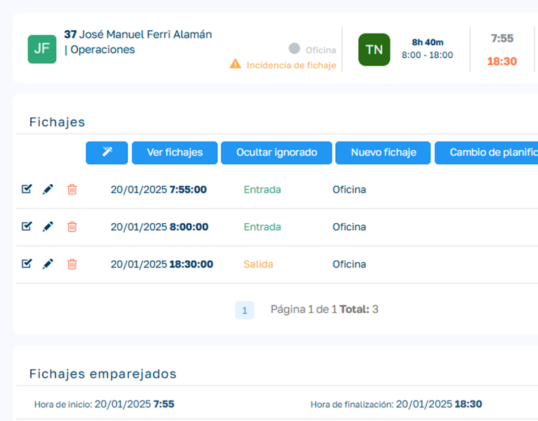

Por tanto, nos vamos a centrar en cómo se desarrolla el cálculo de asignación de turnos y fechas a los fichajes, es decir, como la aplicación sabe a qué turno y a que fecha tiene que asignar cada uno de los fichajes en cada situación.

## Términos importantes

### Tipos de empleado y ventana de jornada

- **Empleado de Tipo Planificado (ETP)**: Estos empleados son los que en su ficha de empleado tienen el campo _Tipo de gestión de fichaje_ con el valor "Planificado" o NULO.
- **Empleado de Tipo Sin Planificar (ETSP)**: Estos empleados son los que en su ficha de empleado tienen el campo _Tipo de gestión de fichaje_ con el valor "Sin Planificar".
- **Empleado Planificado a Fecha (EPF)**: Estos son empleados ETP que además tienen adjudicada una planificación o turno para la fecha en cuestión.
- **Empleado Planificado Sin Planificación Fecha (ESPF)**: Estos son empleados ETP que no disponen de una planificación de turno para la fecha en cuestión.
- **Ventana de Jornada (VJ)**: Es el rango de horas en el que los fichajes se van a asignar a una misma jornada. Podemos configurar la separación mínima de horas entre jornadas (`MinBreakBetweenWorkingDays`) y el número máximo de horas que puede durar una jornada (`HoursUntilNewWorkday`). Si un fichaje excede estas condiciones, se considerará el inicio de una nueva jornada. Por tanto, la ventana de jornada va a depender de la planificación del empleado, de la secuencia de fichajes que vaya realizando e incluso de los posibles fichajes posteriores.

### Parámetros de la ventana de jornada

- **Descanso mínimo entre días laborables (en horas)**: Parámetro de la aplicación (`MinBreakBetweenWorkingDays`). Si el tiempo transcurrido desde el último fichaje es igual o superior a este valor, se infiere que estamos fichando para la jornada siguiente. El tiempo entre una entrada y su salida no cuenta como descanso. Para los ejemplos de este documento tendremos configurado este parámetro a 10 horas (valor por defecto).
- **Duración máxima de la jornada**: Parámetro de la aplicación (`HoursUntilNewWorkday`), con la etiqueta "Define el número máximo de horas que puede durar una jornada laboral antes de considerarse el inicio de una nueva". Por defecto vale 0 (desactivado). Este parámetro solo tiene efecto si su valor es mayor que cero. Si el tiempo transcurrido desde el _primer fichaje_ de la jornada actual supera este valor y el fichaje actual es en una fecha diferente a la del inicio de la jornada, el sistema inferirá que se trata de una nueva jornada. Esto evita que jornadas excepcionalmente largas se extiendan indefinidamente a través de múltiples días si hay un corte lógico para crear una nueva jornada. Para los ejemplos de este documento tendremos configurado este parámetro a 12 horas.

### Procesos de asignación de fichajes

- **Algoritmo de cálculo y asignación de fichajes (ACAF)**: Es el proceso por el cual se realiza la asignación de un turno y una fecha de jornada a un fichaje determinado. Además, también se encarga de establecer los pares de fichajes, enlazando las entradas con sus correspondientes salidas.
- **Recalcular Jornada (RJ)**: Este proceso se ejecuta sobre una jornada determinada (fecha): desasigna sus fichajes y los vuelve a asignar con ACAF. De las jornadas posteriores solo se tienen en cuenta los fichajes que no estén fijados ni cerrados, uno a uno; un fichaje fijado no bloquea a los que vienen detrás. No recalcula jornadas en estado "En Balance".
- **Proceso de Asignar Jornada a Fichajes (PAJF)**: Este proceso se ejecuta sobre un conjunto de fichajes para asignarles una jornada determinada que normalmente diferirá de la que se ha calculado en ACAF. A los fichajes afectados se les asigna el turno planificado del día de destino y quedan desfijados. La jornada de destino debe estar en estado "Generado" y no puede haber más de un día de diferencia con la original.

### Estados del fichaje

- **Fichaje Cerrado (FC)**: Cuando se valida la jornada de un empleado todos sus fichajes pasan a estado cerrado, esto quiere decir que no se permitirá la reasignación de fecha de jornada y turno en ese fichaje.
- **Fichaje con Jornada Fijada (FJF)**: Un fichaje con la jornada fijada impide su reasignación de turno y fecha de jornada. Por defecto al generar un fichaje nuevo y asignársele el turno y fecha jornada por parte de ACAF, se le fija la jornada. El personal de RRHH puede desfijar el fichaje desde la lista de fichajes de la jornada del empleado.

## Lógica general

### Fichaje secuencial

En términos generales la lógica de asignación de fichajes a una jornada determinada depende de si el empleado es un empleado planificado o un empleado sin planificar.

- **Empleados Planificados**: Estos tienen asignado un turno (horario) para una fecha determinada. Cuando el empleado ficha dentro de los límites del turno se le asigna el turno planificado y la fecha de jornada del fichaje. Si ficha fuera de los límites, el fichaje se trata como uno sin planificación: si continúa una jornada abierta toma su fecha y su turno, y si abre una jornada nueva queda con el turno "Sin Planificación".

    El sistema permitirá fichajes consecutivos asignándolos a la misma jornada hasta que ocurra alguna de estas situaciones:

    - El fichaje se localiza dentro de los límites del turno de la siguiente jornada.
    - Existe una separación con el fichaje anterior igual o superior a la separación mínima entre jornadas (`MinBreakBetweenWorkingDays`), sin contar el tiempo entre una entrada y su salida.
    - La duración total desde el primer fichaje de la jornada supera `HoursUntilNewWorkday` (si es mayor que 0) y el fichaje actual es de un día diferente al de inicio de la jornada.

- **Empleados sin Planificar**: Estos al fichar por primera vez se les asigna un turno genérico "Sin Planificación" y se les asigna la fecha de jornada del fichaje.

    En los siguientes fichajes se asignará el mismo turno y fecha de jornada del fichaje anterior hasta que ocurra alguna de estas situaciones:

    - Se realiza un fichaje con una separación respecto al fichaje anterior igual o superior a la separación mínima entre jornadas (`MinBreakBetweenWorkingDays`), sin contar el tiempo entre una entrada y su salida.
    - La duración total desde el primer fichaje de la jornada supera `HoursUntilNewWorkday` (si es mayor que 0) y el fichaje actual es de un día diferente al de inicio de la jornada.

!!! warning "Planificado sin planificar"
    Un empleado de tipo Planificado que no tenga planificación asignada actúa como un Empleado sin Planificar.

### Edición de la secuencialidad de fichajes

El personal de RRHH puede editar la secuencialidad de los fichajes del empleado, por varios motivos como por ejemplo que un empleado se haya olvidado de realizar un determinado fichaje.

Estos cambios pueden modificar la separación mínima de jornadas o la duración máxima de la jornada y, por tanto, se deben recalcular tanto el nuevo fichaje como los fichajes posteriores del empleado para preservar la lógica de asignación explicada anteriormente.

## Empleados de tipo planificado

## Empleado planificado para la jornada actual (EPF)

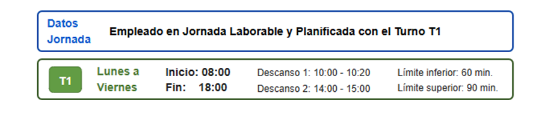

### Fichar dentro de los límites del turno

Es el fichaje más habitual, se asignan turno y fecha correspondiente y no se genera ningún tipo de incidencia.

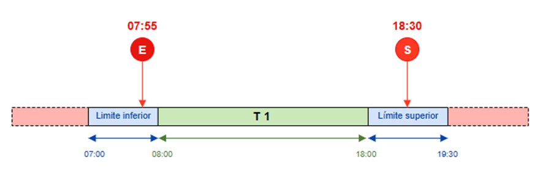

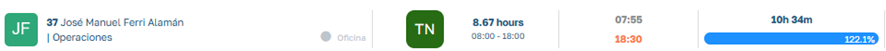

### Fichar entrada o salida fuera de los límites del turno

<!-- PENDIENTE: validar en un entorno. Según el código (pMarkings_NotPlanning_Insert y el test T2 de pTest_Fichajes_Functional) una entrada fuera de la ventana abre jornada con turno -1; las capturas de este apartado muestran el turno planificado. -->
Una entrada antes del límite inferior del turno queda fuera de la ventana del turno, igual que una salida después del límite superior.

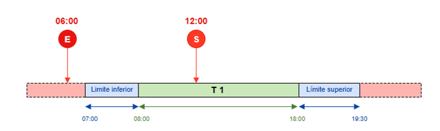

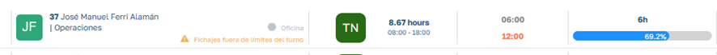

ACAF no puede asignar el turno a una entrada fichada fuera de los límites del turno, así que la trata como un fichaje sin planificación: al no haber fichajes anteriores abiertos, abre una jornada con la fecha del fichaje y el turno "Sin Planificación". Revisa la jornada y, si es necesario, usa **Cambiar turno** (ver [Empleado sin planificación para la jornada actual](#empleado-sin-planificacion-para-la-jornada-actual-espf)).

### Excesos extraordinarios en la jornada

En situaciones puntuales, por cualquier motivo, puede darse el caso que empleado tenga que continuar realizando fichajes fuera de los límites superiores del turno que tiene asignado para ese día, incluso excediendo en los fichajes la fecha en que se comenzó a trabajar (fichar en dos días diferentes dentro de la misma jornada de trabajo).

En estos casos, ACAF va a ir calculando si cada fichaje pertenece a la VJ actual o ya debe generar una nueva jornada. Para esto, asigna fichajes a la jornada actual hasta que ocurra alguna de estas situaciones:

- Existe una separación con el fichaje anterior igual o superior a `MinBreakBetweenWorkingDays` (en el ejemplo, 10 horas), sin contar el tiempo entre una entrada y su salida.
- La duración total desde el primer fichaje de la jornada supera `HoursUntilNewWorkday` (en el ejemplo, 12 horas) y el fichaje actual es en una fecha diferente a la del inicio de la jornada.
- El nuevo fichaje se encuadra dentro de los límites del turno de la siguiente jornada.

Vamos a poner un caso extremo pero que nos va a servir para ver cómo se comporta el sistema en cualquier variante de fichajes que contemple el esquema siguiente:

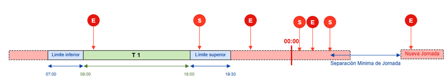

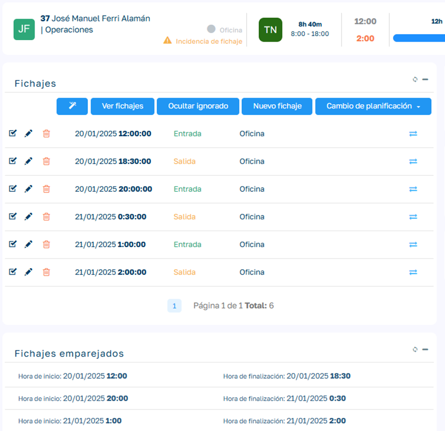

Como vemos, está asignada toda la secuencia de fichajes a la jornada actual (20/01/2025) aunque existan fichajes con fecha del día siguiente, ya que entiende que son pertenecientes a la misma VJ, esto será así hasta que exista un fichaje que supere las 10 horas de separación (parámetro) o este se encuadre dentro del límite del turno de la siguiente jornada (en el ejemplo un fichaje que supere las 7 am, límite inferior del turno asignado al empleado para la siguiente jornada)

### Edición o inserción de fichajes con una jornada posterior sin validar ni fijar (En/Sn)

Una vez el empleado ha fichado, los usuarios con Rol de HR pueden realizar modificaciones o nuevas inserciones de fichajes, ya sea por olvidos o equivocaciones del empleado a la hora de fichar. Cuando realizamos esto dentro de los límites del turno, el funcionamiento es el habitual, pero hay casos menos habituales que tenemos que conocer cómo se comporta ACAF.

En este ejemplo tenemos fichajes en una jornada (E1,S1) y fichajes en una jornada posterior que tenemos sin validar y sin fijar jornada (En,Sn):

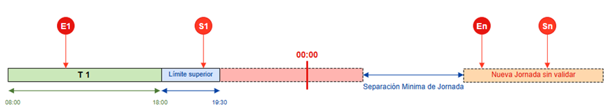

Para este ejemplo vamos a introducir dos nuevos fichajes (E2,S2) que rompan la separación mínima de jornadas:

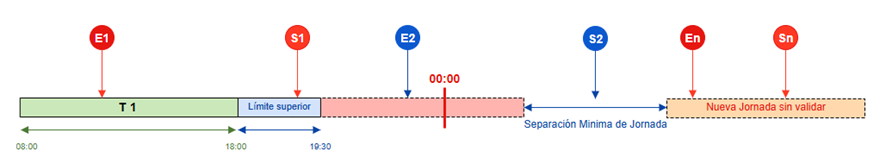

Al insertar o modificar E2/S2, ACAF solo mueve los fichajes posteriores que no estén fijados. Como todo fichaje queda fijado al asignársele jornada, lo normal es que En y Sn permanezcan en la jornada en la que están.

Para que En y Sn pasen a formar parte de la jornada actual junto a E1, S1, E2 y S2 (porque pertenecen a la misma VJ), desfíjalos desde la lista de fichajes de su jornada o lanza el proceso RJ sobre la jornada posterior.

### Edición o inserción de fichajes con una jornada posterior validada o con fichajes fijados (En/Sn)

En este caso los fichajes En y Sn no van a cambiar de jornada: los de una jornada validada están cerrados, y los fijados no se reasignan. Cada fichaje se evalúa por separado: un fichaje fijado no impide que se reasignen los que vienen detrás si no están fijados.

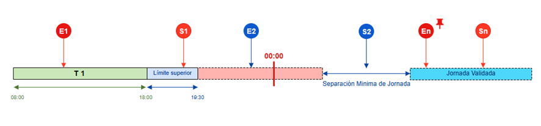

## Empleado sin planificación (ETSP)

Este tipo de empleados actúan siempre sin planificación, lo cual implica que no van a tener un tiempo teórico de trabajo. Como veíamos en el apartado Lógica General, el empleado irá realizando fichajes sobre la jornada de inicio del primer fichaje hasta que se genere una nueva VJ, considerando tanto `MinBreakBetweenWorkingDays` como `HoursUntilNewWorkday`.

## Empleado sin planificación para la jornada actual (ESPF)

Estos empleados que siendo ETP no tienen planificado un turno para una fecha, actuarán como si tratasen de ETSP para esa fecha.

El sistema nos advertirá que existe una incidencia en la planificación del empleado ya que es un empleado que se espera que tenga un planificación y no la tiene. Además vemos que el tiempo previsto de jornada es 0 horas y con turno no asignado.

Pese a ello el sistema permitirá registrar los fichajes del empleado.

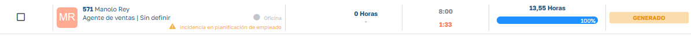

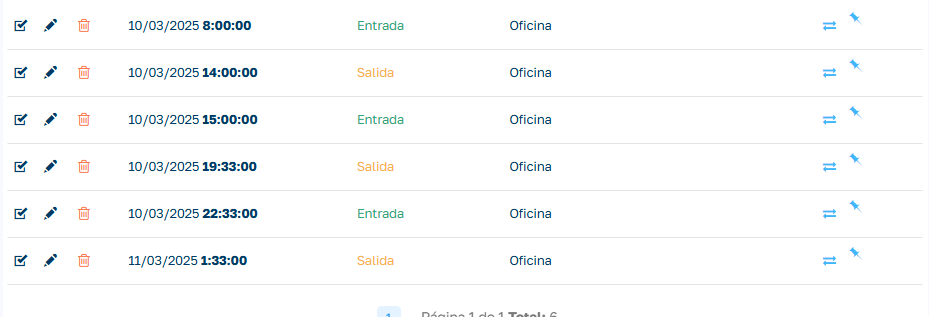

En estos casos, si es necesario, ya sea porque se nos olvido planificarlo o cualquier otro motivo, podemos asignar el turno a la jornada del empleado para que se recalcule el horas realizadas en base a las horas teóricas del turno. Para ello vamos al detalle de la jornada del empleado, abrimos el desplegable **Planificación** y elegimos **Cambiar turno**. Seleccionamos el turno que queremos aplicar y se regenera la jornada del empleado con los nuevos datos de planificación. El desplegable no está disponible si la jornada está validada.

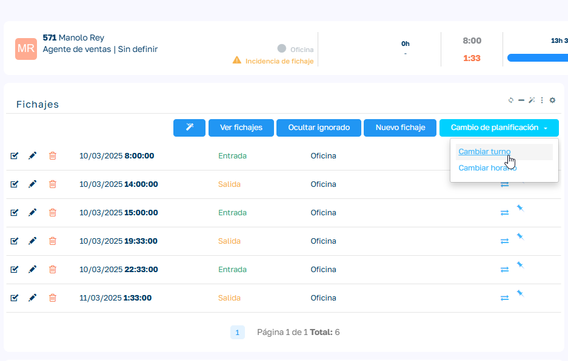

Vemos aquí la jornada ya replanificada:

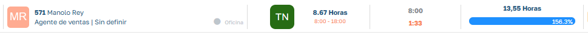
