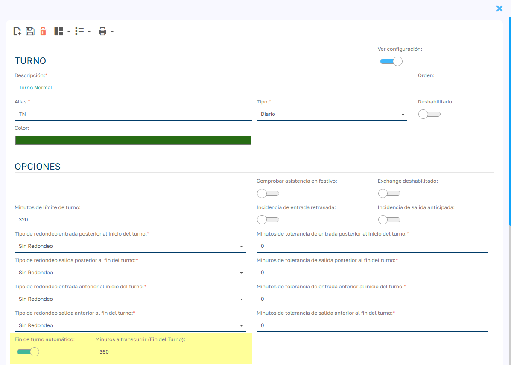

# Automatizar cierre de fichajes pendientes

El cierre automático de fichajes resuelve los casos en los que un empleado no registra su salida al final de la jornada: el sistema le genera una salida a la hora de fin planificada del turno.

## Configura el turno con el cierre automático

1. Ve a `Mantenimiento > Turnos > Turnos`.
2. Selecciona el turno correspondiente.
3. Activa el check **Ver configuración** para desplegar los campos adicionales.
4. Marca el check **Fin de turno automático**.
5. En **Minutos a transcurrir (Fin del Turno)**, indica cuántos minutos hay que esperar desde el fin planificado del turno antes de cerrar el fichaje.

!!! example "Ejemplo"
    Si el turno termina a las 18:00 y configuras 10 minutos, a partir de las 18:10 el sistema registra una salida a las 18:00. El cierre se aplica en la siguiente ejecución de la tarea programada, que por defecto se lanza cada 3 horas.

## Cuándo se cierra un fichaje

El sistema solo genera la salida cuando:

- el último fichaje del empleado es una entrada anterior al fin planificado del turno y falta la salida;
- el turno del último fichaje tiene activado **Fin de turno automático**;
- la jornada es del día actual o del anterior.

La salida se registra como fichaje del sistema, con la hora de la oficina.

!!! warning "Turnos que terminan al día siguiente"
    El cierre automático está pensado para turnos que empiezan y terminan el mismo día. Con turnos nocturnos que acaban en otra fecha puede no cerrar el fichaje correctamente: revisa esos casos a mano.

## Asegúrate de que la tarea programada esté activa

La automatización depende de la tarea programada **AutoEndOfShift_Markings**, que viene activada de fábrica. Para comprobarlo:

1. Accede a `Admin. área > Lógica y reglas > Tareas Cron`.
2. Busca la tarea **AutoEndOfShift_Markings**.
3. Comprueba que esté activada. Si no lo está, habilítala.
