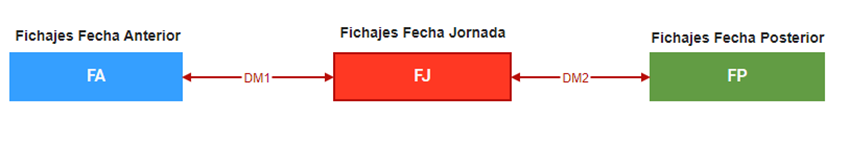
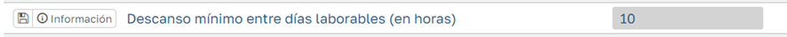
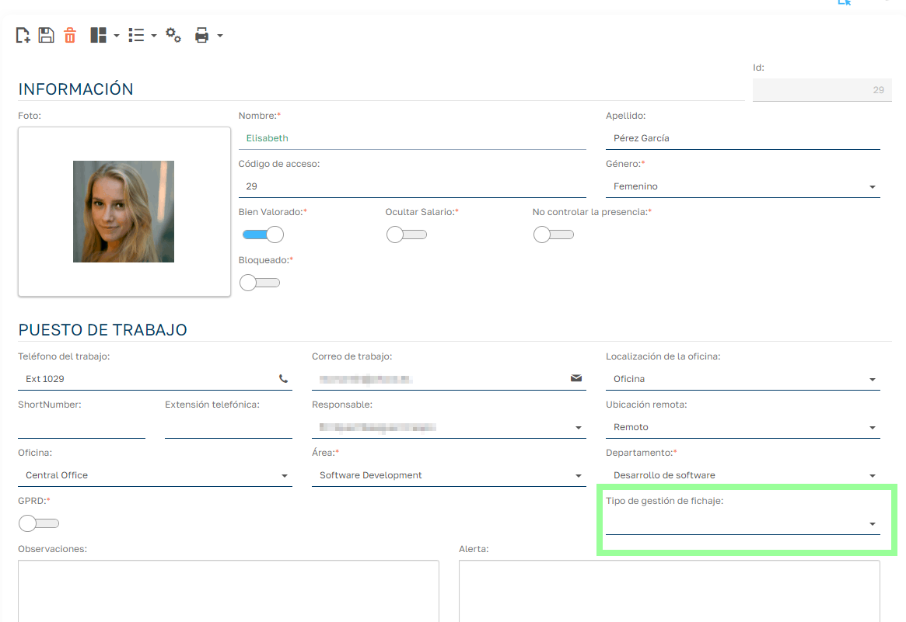
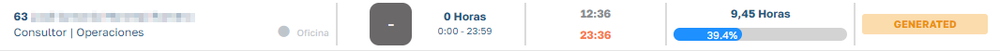

# Empleados sin planificación

Lo habitual es asignar turnos u horarios a los empleados, para conocer el tiempo previsto de trabajo, compararlo con el real y saber cuántos empleados y cuáles habrá disponibles en cada momento.

Aun así, puede haber empleados que no necesiten planificación y de los que solo queramos controlar las horas que hacen cuando acuden a trabajar. Son los _empleados sin planificación_.

Estos empleados trabajan en el turno especial **Sin Planificación**. Hay tres excepciones: si ese día tienen un turno en el planificador de empleados, una regla de modificación de horario o un turno cambiado en la propia jornada, trabajan sobre ese turno (y solo lo toman los fichajes que caen dentro de la ventana del turno). El resto de planificaciones (periodos de cualquier tipo, planificador de grupos, etc.) no se aplican.

## Lógica del fichaje sobre el turno especial "Sin Planificación"

Los fichajes se agrupan por fecha de jornada: la fecha en la que computan sus horas y en la que se gestionan en la gestión de jornadas.

La fecha del fichaje no determina necesariamente la fecha de jornada. En jornadas de tarde o nocturnas es habitual empezar un día y seguir fichando al siguiente: esos fichajes se agrupan en la fecha en que empezó la jornada.

Con el turno Sin Planificación, el primer fichaje del empleado fija la fecha de jornada. Los fichajes siguientes se asignan a esa misma jornada hasta que ocurra alguna de estas situaciones:

- hay un descanso igual o superior al **descanso mínimo entre días laborables** (el tiempo entre una entrada y su salida no cuenta como descanso);
- el parámetro de duración máxima de la jornada está activado, el fichaje es de otro día y se ha superado esa duración desde el primer fichaje de la jornada;
- la jornada anterior está validada: sus fichajes están cerrados y el siguiente fichaje abre siempre jornada nueva.

El detalle de estas reglas, con ejemplos, está en [Asignación de turno y fecha de jornada](asignacion-de-turno-y-fecha-de-jornada.es.md).

!!! note "Modificar fichajes no reasigna solo las jornadas anteriores"
    Al asignarse a una jornada, los fichajes quedan fijados. Si insertas, editas o borras fichajes y quieres que se vuelvan a agrupar (por ejemplo, unir dos jornadas porque el descanso entre ellas ya no llega al mínimo), desfija los fichajes o usa **Recalcular jornada**. Las jornadas validadas o en balance no se recalculan.

## Configuración

En `Mantenimiento > Parámetros > Configuración` están los dos parámetros que separan las jornadas:

| Parámetro | Valor por defecto |
| --- | --- |
| Descanso mínimo entre días laborables (en horas) | 10 |
| Define el número máximo de horas que puede durar una jornada laboral antes de considerarse el inicio de una nueva | 0 (desactivado) |

En la ficha del empleado, pon el campo **Tipo de gestión de fichaje** a **Sin Planificar**.

## Gestión de fichajes

En la gestión de fichajes, los empleados aparecen en el turno especial Sin Planificación:

Las horas previstas son 0 y el tiempo trabajado se calcula a partir de los fichajes. El turno Sin Planificación no tiene redondeos configurados.
