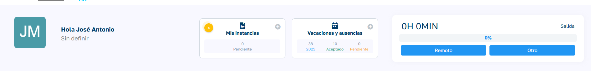
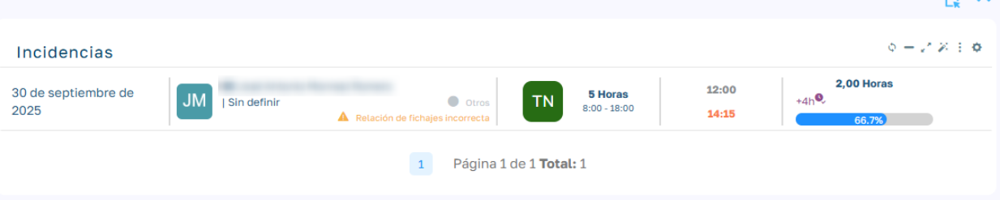

# Visualización de Incidencias

## Descripción general

Los empleados ven en su página de inicio un aviso con las incidencias de fichaje que tienen pendientes, para que las revisen y pidan las correcciones necesarias. Este artículo explica qué cuenta ese aviso y cómo se configura. Lo que ve el empleado está explicado en su propia ayuda.

## Indicador en el dashboard del empleado

En la tarjeta **Mis instancias** de la página de inicio del empleado aparece un círculo amarillo con un número cuando tiene incidencias de fichaje pendientes. Si no tiene ninguna, el indicador no se muestra.

El número cuenta las incidencias pendientes de los últimos días, sin contar el día de hoy. Como la lista que se abre muestra jornadas y una jornada puede tener varias incidencias, el número y las filas de la lista no tienen por qué coincidir.

Solo cuentan las incidencias de fichaje, por ejemplo **Secuencia E/S incorrecta** o **Desfase horario dispositivo**.

## Lista de jornadas con incidencias

Al pulsar el indicador se abre un panel lateral con las jornadas con incidencias:

| Campo | Descripción |
| --- | --- |
| Fecha | Día de la jornada. |
| Turno | Turno asignado. |
| Entrada – salida | Fichajes de la jornada con su ubicación, o "Sin fichajes". |
| Horario | Horario del turno, o el tipo de día si no es laborable. |
| Horas trabajadas | Tiempo trabajado, en horas decimales. |
| Porcentaje | Grado de cumplimiento de la jornada. |
| Diferencia | Saldo respecto a las horas previstas. |
| Incidencias | Icono con el número de incidencias de la jornada. |
| Estado | Estado de la jornada. |

Al pulsar una jornada se abre su gestión de fichajes del día.

## Configuración

El número de días hacia atrás que se revisan se define en `Mantenimiento > Parámetros > Configuración`, con el parámetro **Número de días previos para mostrar incidendias** (así aparece escrito en la aplicación). Por defecto son 30 días.
