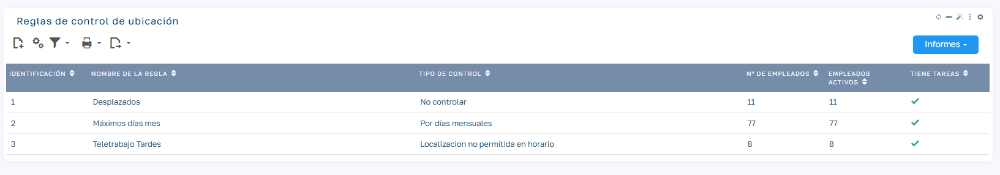
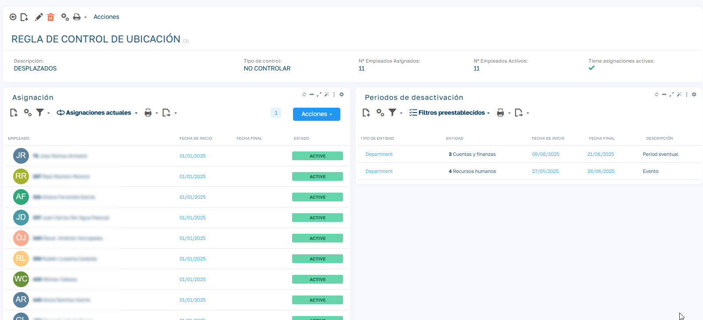
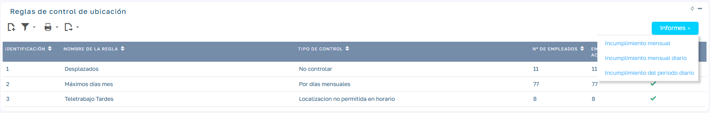

# Reglas de Control de Localizaciones Pro

## Introducción

Las reglas de control de localizaciones permiten definir políticas de asistencia según dónde fichan los empleados (por ejemplo, un máximo de días de teletrabajo al mes). Con ellas puedes:

- crear reglas de control reutilizables;
- asignarlas a uno o varios empleados;
- desactivarlas durante periodos concretos;
- sacar informes Excel de incumplimiento por mes o por periodo.

!!! warning "Requisito previo"
    Antes de crear reglas tienes que tener dados de alta los tipos de localización y las localizaciones (`Mantenimiento > Registros de tiempo > Tipos de Localización` y `Mantenimiento > Registros de tiempo > Localizaciones`).

## Configuración de reglas

### Crear una nueva regla

1. Ve a `Mantenimiento > Registros de tiempo > Reglas de control de ubicación`.
2. Pulsa en nuevo <i class="flx-icon icon-document-add"></i>.
3. Rellena los campos. Según el tipo de control, el formulario muestra unos u otros:

| Campo | Descripción |
| --- | --- |
| Nombre de la regla | Nombre descriptivo de la regla (por ejemplo, "Teletrabajo 8 días"). |
| Tipo de control | Ver la tabla siguiente. |
| Tipo de ubicación controlada | Solo en **Por días mensuales**. Tipo de localización cuyos días se cuentan. |
| Días Máximos | Solo en **Por días mensuales**. Número máximo de días al mes. |
| Ubicación requerida | Solo en **Localizacion requerida en horario**. |
| Ubicación prohibida | Solo en **Localizacion no permitida en horario**. |
| Horario de inicio y Fin del horario | Solo en los dos tipos con horario. Franja horaria en la que se controla la ubicación. |

Los tipos de control son:

| Tipo de control | Cómo funciona |
| --- | --- |
| No controlar | Para los empleados que no tienen ninguna restricción de fichaje por localización. |
| Por días mensuales | Se cuentan los días del mes en los que la localización predominante de la jornada es del tipo indicado. Si se supera el número de días máximos, la regla se incumple a partir de ese día (en el informe se marca el primer día que lo supera). |
| Localizacion requerida en horario | Dentro del horario indicado, el empleado debe fichar en la ubicación requerida. |
| Localizacion no permitida en horario | Dentro del horario indicado, el empleado no debe fichar en la ubicación prohibida. |

<!-- PENDIENTE: los dos tipos con horario tienen dudas en el código. El combo del formulario lista tipos de localización pero el motor (fGetEmployeeLocationsControl) compara con la localización concreta del fichaje, y la condición de "requerida" parece invertida. Un día sin fichajes no genera incumplimiento. Validar con desarrollo antes de detallar más. -->

## Asignación a empleados

Hay dos formas de asignar una regla:

- **A varios empleados a la vez**: en la lista **Empleados**, marca los empleados, pulsa `Acciones > Reglas de control de ubicación` e indica la **Regla**, la **Fecha de inicio** (obligatoria) y, si quieres, la **Fecha de finalización** (vacía = sin fin). Esta opción solo la tienen los usuarios con rol de administración o de Recursos Humanos.
- **Desde la ficha de la regla**: en el bloque **Asignación**, añade un registro nuevo por empleado.

Si un empleado ya tiene asignada la misma regla en un periodo que se solapa, la asignación existente se amplía en lugar de duplicarse.

## Periodos de desactivación

Durante un periodo de desactivación los días no computan para la regla. Por ejemplo, para unas vacaciones colectivas.

### Crear desactivación

1. Abre la ficha de la regla y ve al bloque **Periodos de desactivación** (muestra las desactivaciones vigentes).
2. Crea un periodo nuevo y rellena:

    | Campo | Descripción |
    | --- | --- |
    | Tipo de entidad | A quién se aplica: Oficina, Departamento, Área o Empleado. |
    | ID de entidad | La oficina, departamento, área o empleado concretos. |
    | Regla | La regla que se desactiva. Rellénala siempre: una desactivación sin regla no tiene efecto. |
    | Fecha de inicio y Fecha final | Periodo de la desactivación. |
    | Descripción | Por ejemplo, "Vacaciones colectivas". |

3. Guarda.

<!-- PENDIENTE: el formulario ofrece también "Regla" como tipo de entidad, pero el motor solo aplica desactivaciones generales o por empleado. No documentado hasta confirmar con desarrollo. -->

## Informes

Desde la lista de reglas, el botón **Informes** da acceso a tres informes Excel:

| Informe | Parámetros | Qué muestra |
| --- | --- | --- |
| Incumplimiento mensual | Mes | Los empleados activos que han incumplido alguna regla ese mes, con el número de incumplimientos. |
| Incumplimiento mensual diario | Mes | Lo mismo, con el detalle de cada día incumplido. |
| Incumplimiento del periodo diario | Mes de inicio y Fin de mes | Los empleados que han incumplido en el periodo, con el detalle de cada día. |
