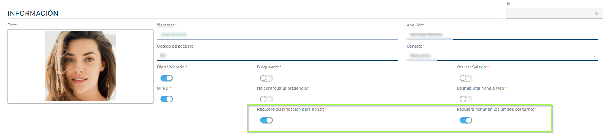

# Restricciones de fichaje

## ¿Qué hace esta funcionalidad?

Sebastian HR puede impedir que un empleado fiche si no cumple ciertas condiciones relacionadas con:

- su contrato;
- su planificación de turno;
- el horario permitido por su turno.

Las restricciones de planificación y horario se configuran por empleado y se comprueban en el momento de fichar.

## Contrato activo obligatorio Pro

En modo PRO, el sistema comprueba siempre que el empleado tenga un contrato en vigor en la fecha del fichaje. Si no lo tiene, el fichaje se deniega y el empleado ve uno de estos mensajes:

| Situación | Mensaje |
| --- | --- |
| Sin contrato en vigor | "No tiene contrato activo. Consulte con el administrador." |
| Contrato discontinuo interrumpido | "Contrato discontinuo interrumpido. Consulte con el administrador." |
| Baja laboral activa | "Baja laboral activa. Consulte con el administrador." |

Si falla esta comprobación, solo se muestra este motivo, aunque también se incumpla alguna de las restricciones siguientes.

## Restricciones configurables en la ficha del empleado

En la ficha del empleado hay dos checks para activar cada restricción:

### Requiere planificación para fichar

Con este check activado, el empleado solo puede fichar si tiene un turno planificado para ese día. Un día planificado como **Libre** cuenta como día sin planificación. La excepción es un turno nocturno del día anterior que todavía esté dentro de su horario.

Mensaje si no tiene turno asignado:

- "Bloqueo de fichaje. Motivo: No dispone de planificación asignada para hoy."

### Requiere fichar en los límites del turno

Con este check activado, el empleado solo puede fichar dentro de los límites de su turno: desde el inicio menos los minutos de límite configurados en el turno hasta el fin más esos minutos (o los límites inferior y superior, si el turno los tiene separados). La hora que se compara es la del servidor.

Si el empleado no tiene turno ese día y solo está activada esta restricción, puede fichar, porque no hay límites con los que comparar.

Mensaje si ficha fuera del horario permitido:

- "Bloqueo de fichaje. Motivo: No puede fichar fuera de los límites del turno."

### Empleados sin planificar

Si el **Tipo de gestión de fichaje** del empleado es **Sin Planificar**, no se aplican las restricciones de planificación ni de límites del turno: el empleado puede fichar en cualquier momento.

## ¿Cuándo se aplica esta validación?

- Cuando el empleado ficha con el botón de fichar, desde la web o desde la app.
- Cuando ficha desde un punto de acceso.

## ¿Cuándo no se aplica esta validación?

- Cuando RRHH introduce fichajes manualmente desde la aplicación.
- Cuando el fichaje entra por una instancia del empleado.
- Cuando el fichaje llega por la Web API (integraciones).
- Cuando se realiza el fichaje desde la APP 1.0 de Fichajes.

## ¿Quién puede modificar estas opciones?

Los usuarios con rol de administración o de Recursos Humanos, que son los que pueden editar la ficha del empleado.
